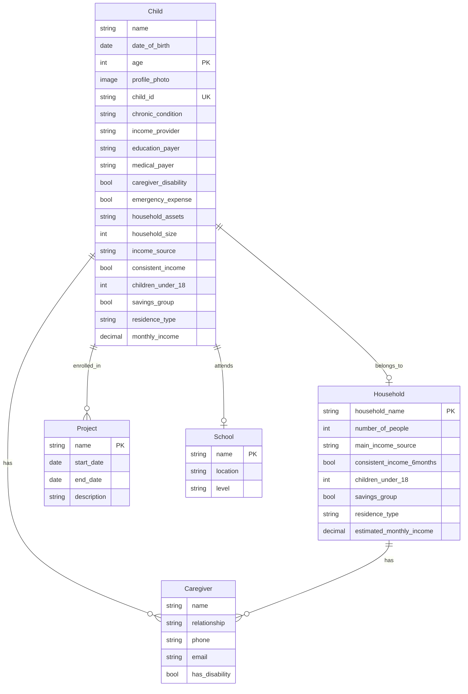

# Charity Management System - Architecture Plan

## Project Overview
- **Tech Stack**: Django 4+, Django REST Framework, PostgreSQL, JWT Authentication
- **Project Type**: Child Scholarship Program Management System

## Application Structure
```
charity_system/
├── charity_system/          # Main Django project
│   ├── settings.py          # Django settings
│   ├── urls.py              # Root URL configuration
│   └── wsgi.py
├── children/                # Child management app
│   ├── models.py
│   ├── serializers.py
│   ├── views.py
│   ├── urls.py
│   └── admin.py
├── households/              # Household management app
│   ├── models.py
│   ├── serializers.py
│   ├── views.py
│   └── admin.py
├── schools/                 # Schools app
├── projects/               # Projects/Events app
└── requirements.txt
```

## Data Model Diagram



## Key Design Decisions

1. **Age Calculation**: Auto-calculated from date_of_birth using a property/method
2. **Unique Child ID**: Enforced at model level with unique=True
3. **Photo Uploads**: Using Django's ImageField with secure file handling
4. **Relationships**: 
   - Child → Household (ForeignKey - one-to-many)
   - Child → Caregiver (ForeignKey - one-to-many)
   - Child → School (ForeignKey - many-to-one)
   - Child → Project (ManyToMany)
5. **Indexes**: On child_id, date_of_birth, and frequently queried fields
